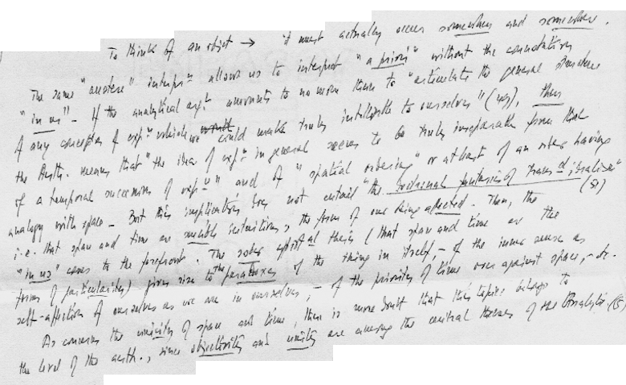
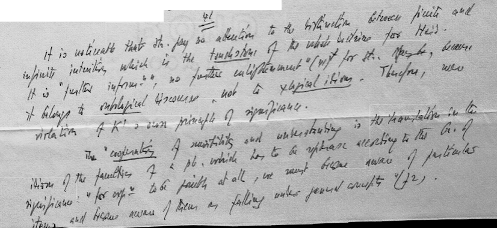

# Paul Ricoeur Transcription Project (Digital Ricoeur)

  

**Author**: Daniel Grant  

**Date Begun**: October 17, 2024  

**Institution**: Bowdoin College  

**Advisor**: Fernando Nascimento  

**Contact**: [dgrant2@bowdoin.edu](mailto:dgrant2@bowdoin.edu)  

**Advisor's Email**: [fnasc@bowdoin.edu](mailto:fnasc@bowdoin.edu)

## Project Overview

This project aims to transcribe the notes and lecture materials of French philosopher Paul Ricoeur using AI-powered handwriting and text recognition technology. The goal is to develop an efficient, scalable solution for digitizing and preserving these important philosophical documents, making them more accessible to scholars and the public.

## Recent Updates

- [Update 1: Initial Approach, Text Segmentation, and Towards OCR Training](updates/reports/October30_2024.md)

## Objectives

1. **Handwriting Recognition**: Utilize advanced OCR tools to transcribe handwritten notes.
2. **Text Processing**: Refine transcribed text for accuracy and readability.
3. **Digitization**: Organize and format the transcriptions for academic use.
4. **Analysis**: Explore methods for analyzing the transcribed data to reveal Ricoeur's thought processes and lecture methodologies.

## Roadmap

[x] Expert-verified transcription of 400+ pages of handwritten Ricoeur Notes
[x] Convert into labelled dataset with image + transcription pairs
[x] Complete text segmentation to create OCR training pipeline friendly dataset
[] Match bounding boxes with ground-truth data
[] Train OCR model(s), compare efficacy by testing with ground-truth data

## Tools and Technologies

- OCR tools for text segmentation and transciption (e.g., EasyOCR, PaddleOCR, Tesseract, Keras_OCR,... )
- Version control: GitHub

## Workflow

1. **Data Collection**: Gather Ricoeur’s notes and lecture materials in digital format. (Note: this step is already completed--500 training examples have been annotated prior to my involvement.)
2. **Model Training and Fine-tuning**: Train and fine-tune the AI models on the annotated data (beginning with tools such as Transcribus, but potentially moving to other models as needed).
3. **Transcription**: Run the AI models on the notes to generate text.
4. **Verification**: Manually verify produced texts for accuracy and completeness.
5. **Final Output**: Compile the verified texts for Digital Ricoeur project.

## Examples (of Ricoeur's Handwriting)

`Figure 1: Example of Ricoeur's Handwriting`

### Expert's Transcription

The applicability of rules to instances does not require a commerce between faculties; the transition from pure categories to categories in use implies, of course, the interpretation of the categories in terms of time. But this is done in the second and third Analogies. If we add the spatial reference given by the first analogy and the refutation of idealism, then nothing more is required for the application. It is only because of the confusion between the metaphysical argument and the imaginary subject of transcendental psychology that Kant feels obliged to give some accounts of the of mind's operations which produce the unity and connectedness of experience. Then we get the story of “synthesis.” 32 The story of synthesis is not necessary to [...] of the strictly analytical argument. Such is the reason why imagination is omitted (four quotations besides discussion on genius 282 sq. 
32, 61, 66, 97

`Figure 2: Example of Ricoeur's Handwriting`

### Expert's Transcription

41 
It is noticeable that Strawson pays no attention to the distinction between finite and infinite intuition which is the touchstone of the whole doctrine for Heidegger. It is “further information,” no further enlightenment” (41) for Strawson. May be, because it belongs to ontological discourse, not to psychological idiom. Therefore, mere violation of Kant’s own principle of significance.
The "cooperation” of sensibility and underlying is the translation in the idiom of the faculties of a problem which has to be rephrase[d] according to the principle of significance: “for experience to be possible at all, we must become aware of particular items, and become aware of them as falling under general concepts” (42).

## Website

For more information on related work and additional resources, visit the [Digital Ricoeur Portal](https://www.digitalricoeurportal.org/digital-ricoeur/).

## Contribution Guidelines

- This project is currently in the research and development phase and is open to collaboration. Feel free to reach out via email if you would like to contribute.

## Acknowledgments

This research is being conducted under the guidance of Professor Fernando Nascimento at Bowdoin College. Special thanks to the Digital and Computational Studies Department for their support. Also, I would like to acknowledge those who have contributed to the Digital Ricoeur project and the preservation of Ricoeur's work before my involvement.

