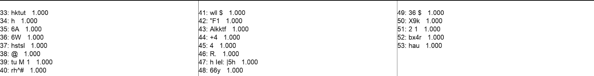

# Update 3: Testing: OCR on Preprocessed images, Training Data Generation

**Date**: December 8, 2024  
**Author**: Daniel Grant  
**Institution**: Bowdoin College  

## Summary

This week, I focused on restructuring my project into a series of importable modules to assist in further development. As such, I did not make quite as much progress on the OCR pipeline. However, I did manage to test the OCR pipeline on the preprocessed images from the last update. The results were not quite as good as I had hoped, with the OCR transcriptions being quite poor. So, I have some new thoughts as to next steps, and more concerns about feasibility. But, I will continue to push forward, with the hope that I can make some real progress in the coming weeks.

## Detailed Description

### Overview

During the last update I optimized the preprocessing process for the images. This week, I completely restructured this pipeline to be more modular and easier to work with. Thus, my project structure now looks as follows:

README.md
license.txt
requirements.txt
updates/
src/
  - __init__.py
  - modules/
    - __init__.py
    - easy_ocr_processor.py
    - image_preprocessor.py
    - skew_correction.py
  - scripts/
    - __init__.py
    - bounding_box_generation/
    - image_preprocessing/
    - ocr_on_processed/
       - __init__.py
       - process_and_ocr.py

This structure (with some unnecessary files and folders omitted for brevity) allows me to import the modules I have created in the `src/modules` folder into the scripts I have created in the `src/scripts` folder. This will make it easier to test and develop the OCR pipeline in the coming weeks.

Outside of this restructuring, I did some testing on the OCR pipeline with the preprocessed images from the last update. Some of the results are shown below

### Testing

As a refresher: "I used [Otsu's thresholding method](https://ieeexplore.ieee.org/document/4310076) to convert the images to binary. This method is adaptive and should work well with the varying lighting conditions in the scans. I found it to be particularly effective in reducing the noise in the images. However, I have (below) tested offsetting the calculated Otsu's theshhold value by a constant to see if it improves the results.

Finally, I additionally tried using a slight gaussian blur to correct for the harsh lighting conditions in the scans (causing some letters to appear thinner than others, in some cases split into multiple path components)."

Now, with a constant threshold offset (18) and gaussian blur (5x5) applied to the images, I tested the OCR pipeline:

#### Example 1

#### Example 2

#### Example 3

### Next Steps

- Determine whether fine-tuning EasyOCR will be sufficient for my needs. If not, I will need to run a full training pipeline on the data.
- Depending on the above, may need toi begin to generate my own training data. This may involve multiple passes with bounding box generation and OCR on the processed images.
- Maybe optimize the preprocessing pipeline further? I do not think this is necessary at this point as I would like to focus my efforts on the OCR pipeline itself.

### Challenges

- Clearly the out-of-the-box transcription for OCR does not work at all, even with a performant preprocessing pipeline. 
- I am unsure whether fine-tuning EasyOCR will be sufficient for my needs. Might need to run a full training pipeline on the data.

Still, Good progress thus far! Next steps are the fun part.

## References

- [Python Modules](https://docs.python.org/3/tutorial/modules.html)
- [EasyOCR](https://github.com/JaidedAI/EasyOCR)
- [PaddleOCR](https://github.com/PaddlePaddle/PaddleOCR)
- [Otsu's Thresholding Method](https://ieeexplore.ieee.org/document/4310076)
- [Gaussian Blur](https://en.wikipedia.org/wiki/Gaussian_blur)

---

*For more information on the Paul Ricoeur Transcription Project, visit the [Digital Ricoeur Portal](https://www.digitalricoeurportal.org/digital-ricoeur/).*

