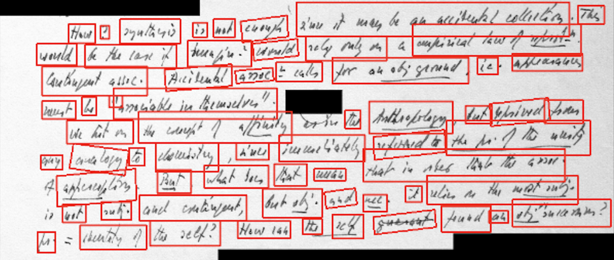
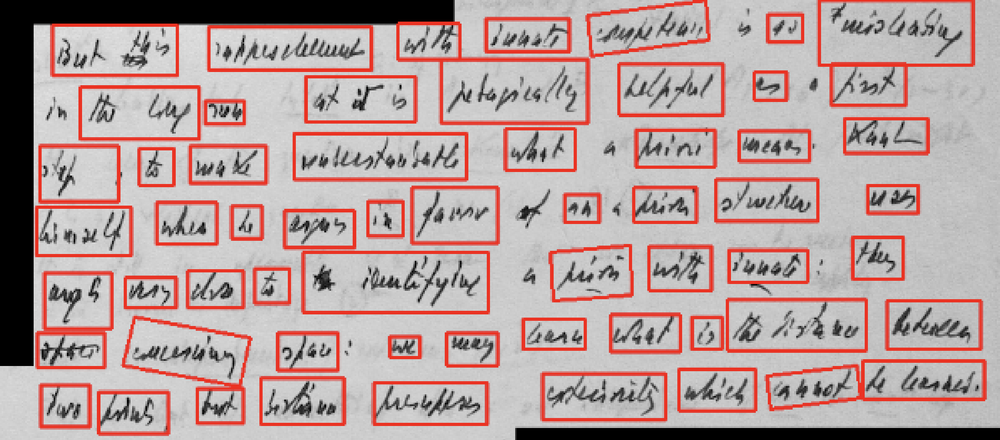
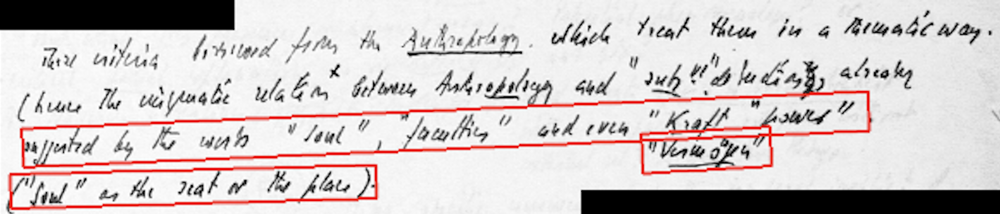
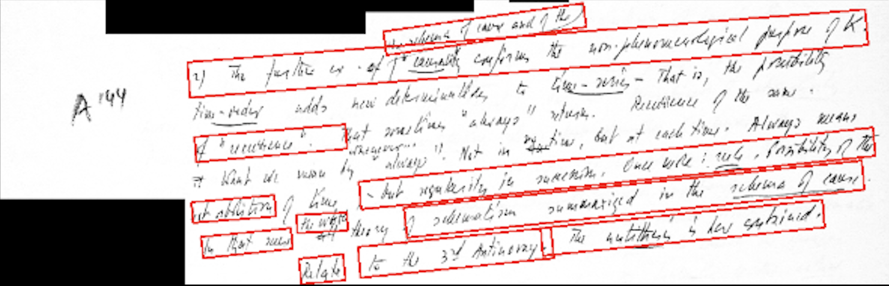
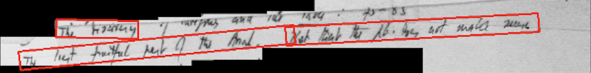

# Update 1: Initial Approach, Text Segmentation, and Towards OCR Training

**Date**: October 30, 2021
**Author**: Daniel Grant  
**Institution**: Bowdoin College  

## Summary

This week I began to explore the various OCR tools available to me, and tested their text segmentation (creating bounding boxes) capabilities on a few of Ricoeur's manuscripts. I am doing this in order to generate training data for a custom OCR model. I tested three tools: EasyOCR, Tesseract, and PaddleOCR. I found that EasyOCR and PaddleOCR had the best results, and I plan to move forward with one of these tools. I will next explore methods of matching bounding boxes with ground truth data, potentially using Levenshtein distance or other string similarity metrics between the OCR output and the ground truth data. Once I have generated a sufficient amount of training/testing data, I will manually verify the results and begin to train a custom model.

## Detailed Description

### Overview

At first, looking for a simple solution to the problem of transcribing Ricoeur's manuscripts, I attempted to use [Transkribus](https.//transkribus.eu/Transkribus/), a platform that uses OCR technology to transcribe historical documents. However, I found that this tool was not best suited for the job quite quickly. Default and community models had a very challenging time deciphering Ricoeur's handwriting. Transkibus's custom model training was also not a viable option, as it requires line-by-line transcription, and manual input (they do have an [API](https://readcoop.eu/transkribus/docu/rest-api/upload/), but it for the most part only supports specifying new model/training parameters, and uploading new images, rather than uploading ground-truth information paired with images). 

Thus, I decided to take a different approach. I quickly found that quite a few OCR tools supported training custom models, but typically with either word-level, line-level, or even letter-level segmentation. Ricoeur tends to write in cursive, and his handwriting is quite messy, so I decided to try to segment the text words rather than individual letters (as his letters tend to run together) or lines (as he often writes in the margins, and his lines are rarely straight).

To do this, I tested the following three tools:
- [EasyOCR](https://github.com/JaidedAI/EasyOCR)
- [Tesseract](https://github.com/tesseract-ocr/tesseract)
- [PaddleOCR](https://github.com/PaddlePaddle/PaddleOCR/blob/main/README_en.md)

### Testing

The following are some results of my testing:

**EasyOCR**:

Most promising. Segmentation seems to be somewhat more granular when compared to Paddle OCR. Seems optimal, between these three, for the generation of an OCR dataset.

**Tesseract**:

 
 
 

Very inconsistent results with Tesseract.

**PaddleOCR**:

Not terrible, but clearly wide variation in results. From what I've found in their documentation, no room for parameter adjustment in their bounding box algo. Not sensitive enough.

### Next Steps

I plan to next move forward with one of the aforementioned tools, most likely EasyOCR or PaddleOCR, as they seem to have the best results. Using these tools, I hope to explore methods of matching bounding boxes with ground truth data, potentially using Levenshtein distance or other string similarity metrics between the OCR output and the ground truth data. Once I have generated a sufficient amount of training/testing data, I will manually verify the results and begin to train a custom model.

### Challenges

This week I found some difficulty in implementing the various OCR tools text segmentation capabilities. I could not manage to get Keras-OCR to work, for example, and decided to stick to the three tools mentioned above, as they both are most starred OCR tools on github, and the best documented (in my opinion). The next step--that of matching bounding boxes with ground truth data--will be a much more challenging task.

## References

[EasyOCR](https://github.com/JaidedAI/EasyOCR), [Tesseract](https://github.com/tesseract-ocr/tesseract), [PaddleOCR](https://github.com/PaddlePaddle/PaddleOCR/blob/main/README_en.md), [Transkribus](https.//transkribus.eu/Transkribus/), [Transkribus API](https://readcoop.eu/transkribus/docu/rest-api/upload/), [Digital Ricoeur Portal](https://www.digitalricoeurportal.org/digital-ricoeur/)

---

*For more information on the Paul Ricoeur Transcription Project, visit the [Digital Ricoeur Portal](https://www.digitalricoeurportal.org/digital-ricoeur/).*

